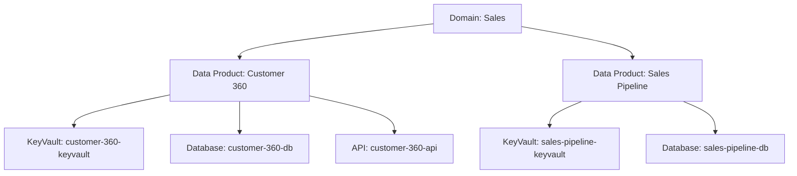

# Data Products Architecture

## Overview

Data Products are the core concept of this IDP. Each data product represents a business capability that produces, transforms, or serves data within the enterprise.

## Data Product Model

### Mapping to Backstage Entities

In Backstage terminology:
- **System** = **Data Product**
- **Domain** = **Business Division**
- **Component** = **Infrastructure Resources** (KeyVault, Database, API, etc.)

### Data Product Structure

```yaml
apiVersion: backstage.io/v1alpha1
kind: System
metadata:
  name: customer-360
  description: Customer 360 analytics data product
  annotations:
    idp.company/business-owner: matthew.taylor@company.com
    idp.company/technical-owner: emma.rodriguez@company.com
    idp.company/cid: CID-30001
spec:
  owner: group:default/idpadmins
  domain: sales
```

## Key Characteristics

### 1. Domain Assignment

Each data product belongs to exactly one domain:

| Domain | Example Data Products |
|--------|----------------------|
| Finance | Revenue Analytics, Financial Reporting, Budget Planning |
| Human Resources | Employee Performance, Workforce Planning, Talent Acquisition |
| Sales | Customer 360, Sales Pipeline, Territory Performance |
| Marketing | Campaign Performance, Customer Segmentation |
| Customer Service | Service Tickets, Customer Satisfaction, SLA Performance |
| Supply Chain | Inventory Optimization, Supplier Performance, Logistics |

### 2. Ownership Model

Each data product has dual ownership:

- **Business Owner**: Stakeholder responsible for business outcomes and data quality
- **Technical Owner**: Engineer/architect responsible for technical implementation

Both are tracked via annotations and displayed in the UI.

### 3. Unique Identifier (CID)

Every data product has a unique Cost/Compliance Identifier (CID):

```
Format: CID-NNNNN
Examples:
- CID-10001 (Finance domain, first product)
- CID-30001 (Sales domain, first product)
- CID-60003 (Supply Chain domain, third product)
```

**CID Structure:**
- First digit = Domain ID (1=Finance, 2=HR, 3=Sales, etc.)
- Last 4 digits = Sequential number within domain

**CID Usage:**
- Cost allocation and chargeback
- Compliance tracking
- Resource tagging in Azure
- Audit trail maintenance

## Data Product Lifecycle

### 1. Creation

Data products are created through:
- Manual catalog entry (YAML files)
- Automated discovery (future)
- Data product templates (future)

### 2. Component Association

Data products contain various components:

```
Data Product (System)
├── Key Vault (Component)
├── Database (Component) [future]
├── API Gateway (Component) [future]
└── Storage Account (Component) [future]
```

Components are linked via `spec.system` field:

```yaml
spec:
  system: customer-360  # Links to parent data product
```

### 3. Discovery & Filtering

Users can discover data products through:

1. **Catalog Page**: All entities with kind filters
2. **Data Products Page**: Dedicated page with domain filtering
3. **Home Dashboard**: Personalized view of owned products
4. **Search**: Full-text search across all metadata

### 4. Evolution & Updates

Data products evolve through:
- Component additions (via templates)
- Metadata updates (ownership, descriptions)
- Configuration changes (annotations)
- Component lifecycle management

## Metadata Standards

### Required Fields

| Field | Type | Description | Example |
|-------|------|-------------|---------|
| `name` | string | Unique identifier | `customer-360` |
| `description` | string | Business description | `Customer 360 analytics data product` |
| `spec.owner` | string | Technical owner group | `group:default/idpadmins` |
| `spec.domain` | string | Business domain | `sales` |

### Custom Annotations

| Annotation | Purpose | Example |
|------------|---------|---------|
| `idp.company/business-owner` | Business stakeholder email | `matthew.taylor@company.com` |
| `idp.company/technical-owner` | Technical lead email | `emma.rodriguez@company.com` |
| `idp.company/cid` | Cost/compliance identifier | `CID-30001` |

## Component Relationship Model



## Governance & Compliance

### Ownership Tracking

- All data products must have both business and technical owners
- Owners are synced from Microsoft Graph
- Group membership determines access rights
- Dashboard shows owned products automatically

### Cost Allocation

- CID is propagated to all Azure resources
- Azure resources tagged with CID for cost tracking
- Enables chargeback to business units
- Supports budget allocation per data product

### Audit Trail

- All component provisioning tracked through templates
- API calls logged with user identity
- Changes to metadata captured in catalog
- Azure resource changes tracked in Azure Activity Log

## Best Practices

### Naming Conventions

**Data Products (Systems):**
- Use lowercase with hyphens
- Be descriptive and business-focused
- Examples: `customer-360`, `revenue-analytics`, `employee-performance`

**Components:**
- Include parent system name
- Include component type
- Include environment if needed
- Examples: `customer-360-keyvault`, `revenue-analytics-db-prod`

### Metadata Maintenance

1. **Keep descriptions updated**: Reflect current functionality
2. **Maintain ownership**: Update when team members change
3. **Tag appropriately**: Use tags for categorization
4. **Document dependencies**: Use catalog relationships

### Security & Access

1. **Least Privilege**: Components inherit ownership from parent system
2. **Separation of Duties**: Business and technical owners have different roles
3. **Audit Logging**: All actions tracked for compliance
4. **Azure RBAC**: Integrate with Azure role-based access control

## Future Enhancements

### Planned Features

1. **Data Product Templates**: Self-service data product creation
2. **Data Lineage**: Track data flow between products
3. **Quality Metrics**: Monitor data quality scores
4. **SLA Tracking**: Track uptime and performance metrics
5. **Cost Dashboards**: Visualize costs by domain and product
6. **Automated Compliance**: Compliance scanning and reporting

### Integration Roadmap

1. **Data Catalogs**: Integrate with enterprise data catalog
2. **CI/CD Pipelines**: Link to deployment pipelines
3. **Monitoring**: Integrate with observability platforms
4. **Incident Management**: Link to incident tracking systems
